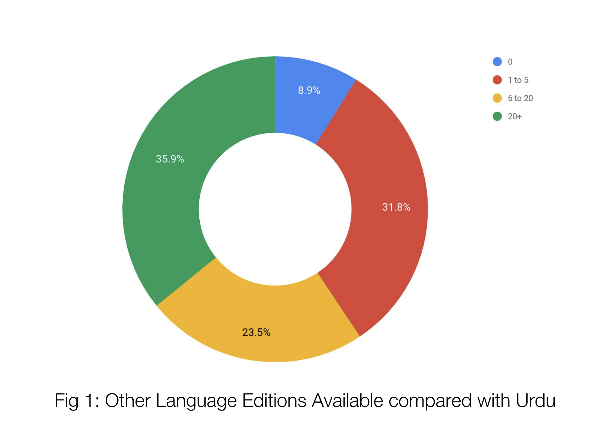

# 5000 Years of Notable People 

### Authors:

`Waleed Hashmi:`    github.com/WaleedHashmi 

`Aizaz Ansari:`     github.com/AizazAnsari

## Background

Pakistan is a country where English, while not the first language, is given the status of the
official language of the country and is the primary language of educational and research
institutes. The national language of Pakistan, Urdu is, as a result, undermined. The focus
on English as a medium for governmental and educational affairs has discouraged
publication of new literature in Urdu and has reduced this language’s relevance and
importance. Is undermining Urdu justified? Or can it be used as a knowledge base to
complement more popular languages like English? This paper will try and answer these
questions and come to the conclusion that while English might be the best source of
knowledge, languages like Urdu host valuable information not found elsewhere and thus,
their importance cannot be overlooked. This paper will also show that while Urdu cannot
replace English as a knowledge base, it should be used alongside other popular (English)
and similar (Hindi) languages with an interdependent approach to gain access to a wider
database of information.

## Research Design

To perform our analysis on Urdu as a knowledge base, we utilized Wikipedia for case
studies. This is because Wikipedia, since its creation in 2001, has grown to become the
largest online encyclopedia. A huge subset of data on Wikipedia is articles in 293 language
editions on notable people who have lived over the past 5000 years.

To make the findings of this paper more universal, it was necessary for us to study another
language that is being overpowered by English. A language very close to Urdu, in this
matter, is Hindi. In India, Hindi is facing a decline similar to the one being faced by Urdu in
Pakistan. Therefore, adding Hindi to our research should, in theory, yield results similar to
those obtained from Urdu and make our findings more concrete. Findings using Urdu and
Hindi databases will lead us to show the trend and relationship of English with these
languages which can be generalized to other languages facing similar fates.

Before we move on to the design of our data extraction algorithms, it is very important to
note that Wikipedia pages are divided into several categories without any unified list
containing all categories. For any given notable person, categories can range from
professions to places and dates of birth and death. Our data extraction mainly centers
around the categories linked to dates of birth and death e.g People born in 1967. From
these two editions (Urdu and Hindi) of Wikipedia, we first extracted the Names and URLs
by accessing the common Wikipedia categories. This created an intermediary database
which was then used to check how many language editions every article had and
thereafter, another database was created. This database not only had the total number of
language editions, which can reflect the notability of an individual, but it also documented
the existence or lack thereof of articles of these recorded notable people in the 7 most
populous Wikipedia editions.

In this study, we will utilize the databases (and particularly the data about existence in
other language editions) as independent variables. The aforementioned obtained
information will help us demonstrate the importance of non-english Wikipedia articles, our
dependent variable.

## Technical Approach

While the findings of this paper are extremely significant, the data extraction and collection
is also an integral part of this project which will not only lay the foundation for the
conclusions of this paper but also help in future statistical analysis. The basic idea was to
create an intermediary database (Names and URLs of individuals only) and use this to to
create another database which records information about the articles’ language editions.
For Urdu, we created both the databases from scratch and for Hindi, we were provided
the names of all individuals on Wikipedia by Palaash Bhargava. This was further expanded
by including URLs and creating the second database about language editions. All of the
code was written in Python. Python Libraries BeautifulSoup and Pandas were used for
web scraping and database management respectively. For simplicity purposes, we have
divided the code into two phases.

### Phase 1 - Extracting Names and URLs

We started off by accessing a large list of individuals by creating URL links to various
categories (mentioned later). Several loops were run to iterate through them to extract
articles of individuals. Following is the snippet of code used to iterate over a placeholder
category:

    for i in reversed(range(starting_period_after_christ,final_period_after_christ)):
           url = "https://ur.wikipedia.org/wiki/" + "زمرہ:" + str(i) + "ء_کی_وفیات"
           // ... code to extract data

A list of the categories that we looped over for the data extraction is as follows:
  1. Living People
  2. Possibly Living People
  3. Deaths by Years
  4. Deaths by Centuries
  5. Deaths by Millenniums
  6. Births by Years
  7. Births by Centuries
  8. Births by Millenniums
  9. Year of Death Unknown
  10. Year of Birth Unknown

Before looking at how web scraping works for these pages, it is crucial to understand the
page structure of a Wikipedia page. All the names are stored as a list under the `<LI>` tag.
and all of these are in a `
` called mw-pages. Now, the code’s job is to extract every list
element that has a link attached to it inside the division of mw-pages. It did so as following:
  
    soup = bs(response.text, "lxml")        
    page = soup.find("div",id="mw-pages") 
    names = page.find_all("li")
    for node in names:
        name = node.text
        url = node.find("a").get("href")
        url_long = Wiki_base_url+url 
        dict_output['list_individuals'].append((name,url_long,cat))  

After 3 attempts of leaving this code to run overnight, we were finally able to extract an
exhaustive set of 11,542 names and URLs from the Urdu edition of Wikipedia.
The earlier mentioned dataset that was provided by Palaash Bhargava consisted of 9,585
names from the Hindi edition of Wikipedia. We wrote a small piece of code to extract the
URLs from this dataset. After running this code, we had similar intermediary databases of
Hindi and Urdu.

### Phase 2 - Extracting Names and URLs

The next task was to create the database that would be used for our analysis. The aim of
this code was to record the existence or lack thereof of Urdu/Hindi pages in other editions
including English, German, French, Italian, Spanish, Swedish, Portuguese (the 7 most
populous languages of Wikipedia). The total count of Wikipedia language editions available
for each page was also stored. The code of this phase was relatively shorter but took a
long time to run because of the thousands of page requests that were being performed
(one for every individual’s page). For every page, we accessed the anchor tags that had
“href = lang” to identify the languages they had articles in and this information was stored
in another .csv file that was used for our analysis. Following is the snippet of code that
does this:

    for language in languages:
        try: 
            item = soup.find('a', {"hreflang":languages.get(language)})["href"] 
            has_edition[language] = "Yes"
        except:
            has_edition[language] = "No" 

Due to the similar structure of the Urdu and Hindi intermediary databases, we were able to
run the same code on both.

## Challenges

While writing and running this code, we ran into several challenges. Our foremost
challenge was to cater to the fact that the Urdu script runs from right to left as opposed to
English script which runs from left to right. This made it harder for us to deal with string
concatenation in Python since URLs to Urdu articles contained both the English and Urdu
script. We used several string analysis techniques to overcome this. Another challenge we
faced was with looping over ordinal numbers for the categories Centuries and Millenniums.
English has a very predictable pattern in ordinal numbers (e.g tenth, eleventh, twelfth etc.)
but Urdu has a different system which could not be looped over very easily. To fix this, we
made our code loop over the English ordinal numbers for Centuries and Millenniums and
from these category pages in English Wikipedia, we used the BeautifulSoup library to find
and redirect to the Urdu URLs for the same category pages. Following is the code for this:

    link_millennium = ['1st','2nd','3rd','4th']
    for element in link_millennium:
        url = "https://en.wikipedia.org/wiki/Categories:" + element + "-millennium_BC_births"
        res = requests.get(url) 
        soup = bs(res.text,"lxml")
        try:
            item = soup.find ("a",{"hreflang":"ur"})["href"]
            dictionary = function_scrap_year(URL)

Furthermore, while generating URLs from the Hindi dataset of names, it was difficult for us
to initially understand the design of the script (which we found to be similar to english) due
to our unfamiliarity with the language. We had to use google translate to understand the
Hindi script better and cater to several corner cases.

Another problem that we came across was because of the massive scale of the data that
we were working on. We lost connection several times to the Wikipedia servers including
one time when only 11 years (out of 5000) of scraping was left. For the second phase of
our code, we structured our code in such a way that it wrote the results in the database
whenever it ran into an error. This made us save time in the case of a loss of connection or
any other interruption.

## Findings

By comparing Urdu edition of Wikipedia to other editions of Wikipedia, we found out that
out of the 11,542 pages extracted, 994 pages (8.9%) are completely unique to the Urdu
edition of Wikipedia — they don’t appear in any other Wikipedia edition. Following is the
distribution of language editions of the pages collected from the Urdu edition of Wikipedia.

As mentioned earlier, the 7 most populous editions of Wikipedia have already been
scraped. Comparing the pages from the Urdu data set to these versions, we found out
that 1,205 pages (10.44% of the Urdu Dataset) do not have a corresponding page in any
of these 7 editions of Wikipedia. This strengthens the hypothesis about the importance of
languages like Urdu and their addition to the knowledge base. It shows that every
language has a significant amount of information that cannot be found in English or other
databases of populous language editions. Out of these 1205 pages independent from the
7 populous editions, approximately 17.2% of them exist in other less populous language
editions. This number, although very small, includes several important people who cannot
be ignored. This depicts the interdependence of less populous language editions and their
independence from populous editions.

Similar tests were run on the Hindi data set.

The results are very similar to Urdu database. 1,539 pages were found to be unique to
only Hindi and only 1,870 pages had editions in 20 or more languages. It was also found
that 1,651 pages (17.2% of the Hindi database) are not a part of any of the 7 Wikipedia
editions. This reinforces the importance of Hindi and its interdependence with other less
populous language editions. The percentage of articles unique to Hindi, when compared to
Urdu, is almost double. This hints the strength of Hindi edition of Wikipedia over its Urdu
counterpart and shows that the conclusions drawn using the Urdu dataset are more
concrete when applied to the Hindi edition since it is more independent from populous
language editions when compared to Urdu.

Another approach to analysis of the databases was to compare the dataset in Urdu to the
7 most populous Wikipedia editions.

English shares the highest number (88.9%) of Wikipedia pages with Urdu. All of the other
populous editions more or less share a similar number of around 5000 pages with Urdu.
Most of these pages can be linked to fig. 1 that showed 59.4% of the pages from the Urdu
edition had 5 or more Wikipedia editions. Thus, it is due to a large number of pages
available in these 7 languages alongside Urdu that it is easy to overlook the pages unique
to llanguages such as Urdu and the interdependence between these less populous
language editions of Wikipedia.

Similar study can be done on the Hindi dataset.

The analysis of the Hindi dataset reveals very similar results with English sharing the
highest number of pages with it’s Hindi counterpart.

Coming back to the point of interdependence of less populous languages, it is very
important to study Urdu and Hindi together. We decided to add Hindi to our research not
only to make our findings more concrete but also because of the shared colonial history of
Pakistan and India which would have further contributed to the similarity of the yielded
data sets. However, initial findings revealed that only 28 pages were unique to Urdu and
Hindi combined. We modified our analysis technique and identified pages which did not
exist in the 6 populous language editions (excluding English) but existed in Urdu and Hindi
for sure and may/ may not have pages in any other language editions (including English
and other local languages). This increased the number of pages to 888 from 28 which
makes up of 7.69% of the Urdu database and 6.92% of the Hindi dataset. The modified
analysis showed that while Urdu and Hindi do not have many articles unique to them,
taking other regional and local languages (and English) into consideration expanded our
dataset and showed how Hindi and Urdu were linked by the local languages and English
from the pre-independence and colonial era when Hindi, Urdu, English and many other
local languages were in use throughout the subcontinent.

## Conclusion

In our research, we collected data from 2 closely related languages and analysed it to
depict the importance of these languages. Our findings reaffirm the importance of
expanding the knowledge base to languages like Urdu and Hindi and how, by overlooking
these less populous languages, we are ignoring huge amounts of valuable information.
Alas, with the decline of less populous languages, we are losing no only their literature but
also culture linked with it.

Our work, we believe, would open up avenues for further research since the
interdependency or correlation of different Wikipedia editions can be put through deeper
analysis and trends can be observed in languages belonging to close by regions.
